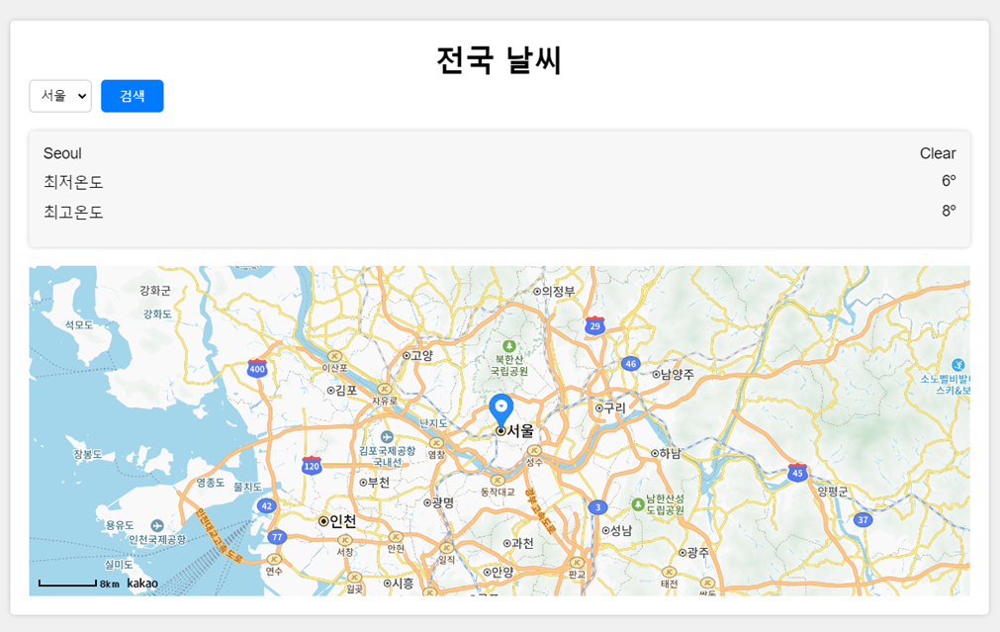
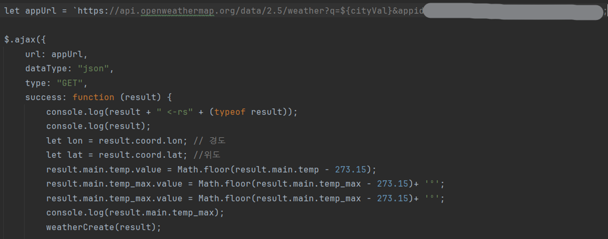
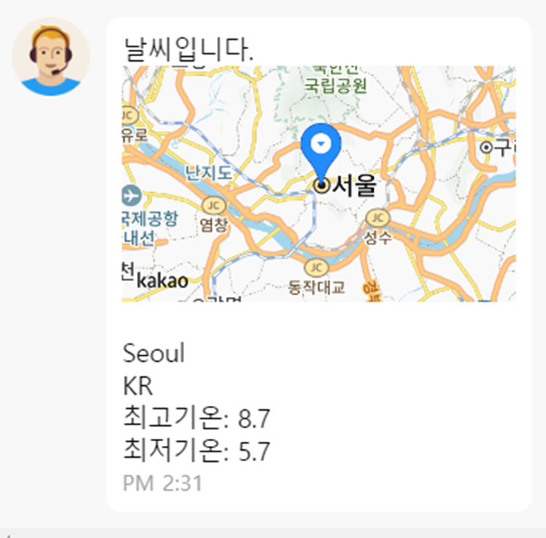

# SpringBoot-Project-SoleManager

스프링 부트 -> 프리랜서 중개 에이전시 그룹웨어
 

## 🖥️ 프로젝트 소개

1. 프리랜서와 회사 간의 적합한 프로젝트를 찾아 매칭하는 서비스 제공
2. 계약서 작성, 결제 처리 및 금융 관련 서비스를 제공
3. 프리랜서와 회사 간의 원활한 커뮤니케이션을 제공
   다음과 같은 역할을 하는 그룹웨어에 서비스를 추가한 프로젝트입니다.
    

### ⌛️ 개발 기간

* 23.09.26 ~ 23.10.25 (약 1개월 소요)
* (추가) 23.10.26 ~ 23.11.03 (약 10일 소요)

### 🏃‍♀️ 맴버 구성

* 김예진(팀장) : 근무/근태(R), 급여(C,R), BaseLayout디자인, 모달디자인, PPT, 영화 API
* 김양현 : 로그인, 이메일 인증, 비밀번호 재설정, 권한별 LIST, 로그인&회원가입 디자인, 날씨 API
* 박정현 : 게시판(CRUD), 댓글, 파일, FUllCalendar일정추가, 웹소캣 알림 챗봇, 메인페이지디자인, PPT, 버스 API
* 방효빈 : 회원(CRUD), 회원페이지 디자인, 날씨 API
* 안윤기 : 결재(CRUD), 버스 API
* 이지훈 : 근무/근태(CUD), FUllCalendar(근무,프리랜서일정), 네이버웍스 구현, CI/CD, 영화 API

### 🛠️ 개발 환경

### ⚙️ DB 구성

### 김양현

회원가입

### 회원가입 이메일 인증

### 회원가입 폼

### 우편번호 찾기

카카오 오픈 API를 이용한 우편번호 찾기 입니다.

비밀번호 찾기

### 비밀번호 찾기 이메일 인증

### 비밀번호 재설정

### 폼 자세히 보기

#### 비밀번호 찾기

#### 비밀번호 재설정

JS와 JavaMailHandler를 이용한 이메일 인증 및 비밀번호 재설정 입니다.

로그인

### 로그인 폼

Oauth2를 이용하여 다른 소셜 계정으로 로그인 할 수 있습니다. 

### OAUTH2 추가 정보 입력

단, Oauth2로 최초 로그인을 할 시, 추가 정보 입력을 해야합니다. 

권한별 리스트

### 권한에 따른 3개의 리스트

회사계정, 직원계정, 프리랜서계정에 따라 각기 다른 list목록들입니다.

#### JPA 쿼리

JPA를 이용하여 리스트병 paging, search 등의 쿼리기능을 구현하였습니다. 

날씨 API

### API를 이용하여 오늘 날씨 가져오기

날씨와 지도를 보여주는 페이지입니다.

API에서 온도를 가져오는 코드입니다.

온도를 DB에 저장하는 코드입니다.

### 챗봇 시나리오

챗봇에 "서울 날씨"를 치면 나오는 정보입니다.

정보(온도)를 나타나게 하는 코드입니다.

챗봇에 지도를 나타나게 하는 script 코드입니다.

